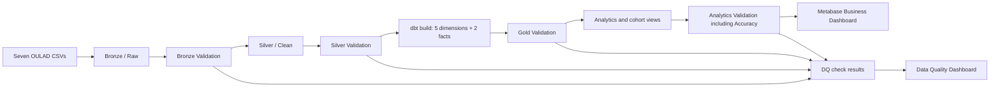

# OULAD Student Performance and Engagement Pipeline

An end-to-end Open University Learning Analytics Dataset pipeline with raw and
clean layers, a dbt mart, validation at every layer, and Metabase-ready
analytics for performance, engagement, cohorts, and dropout risk.

## Team-query preservation

The original group SQL bodies are retained in `src/ingestion/`, `src/cleaning/`,
`src/mart/`, `src/data-quality/`, and `tests/cleaning-validation.sql`; short
header notes identify their final equivalents. The numbered folders add a
complete, ordered assignment path around that work and do not erase it. Use the
numbered notebooks for the final run because they add configuration, layer
gates, dbt integration, Analytics outputs, and dashboard views. The original
files remain available for comparison and contribution history.

## Assignment alignment

| Requirement | Repository implementation |
|---|---|
| Ingest CSVs into raw | `src/01_bronze/sql/02_bronze_sources.sql` |
| Standardize types and missing values | `src/02_silver/sql/04_silver_tables.sql` |
| Two facts | `fact_assessments`, `fact_vle_interactions` |
| Five dimensions | Student, Course, Module Presentation, Date, Demographics |
| Implement the mart in dbt | `dbt_project.yml`, `models/mart/` |
| Build Metabase dashboards | `metabase/README.md`, `metabase/dashboard_queries.sql` |
| Prove trust and reliability | Bronze, Silver, Gold, and Analytics validation suites |

## Architecture




Accuracy is consolidated in Analytics validation as cross-layer control-total
reconciliation. It does not claim comparison with an external real-world truth
source.

## Final star schema

The core mart contains exactly two facts and five dimensions:

- `fact_assessments`: one student assessment submission; event-based fact.
- `fact_vle_interactions`: one student, module presentation, VLE site, and
  relative day after daily click aggregation; aggregated fact.
- `dim_student`: one anonymized student identity.
- `dim_course`: one module code.
- `dim_module_presentation`: one specific offering of a course.
- `dim_date`: one relative course day.
- `dim_demographics`: one distinct demographic profile.

Both facts connect directly to all five dimensions. `course_key` on
`dim_module_presentation` is tested for consistency in dbt, but the BI model
does not require a dimension-to-dimension join. See `docs/data-model.md`.

`student_cohort` is a supporting table in `04-analytics`, not a third Gold
fact. It keeps all enrolled students—including learners with no assessment or
VLE event—so cohort and dropout metrics have the correct denominator. It owns
`final_result` and derived `is_withdrawn` because their grain is one student
enrollment per module presentation, not one demographic profile.

## Why Course and Module Presentation are separate

`dim_course` represents the module, such as `AAA`. `dim_module_presentation`
represents a specific run, such as `AAA-2013J`, whose length may differ from
another run. This follows the assignment's explicit dimension list while
keeping presentation-level attributes out of the course grain.

The approved relationship diagram is the contract implemented by both dbt and
the Databricks SQL compatibility build:


## Dates

OULAD date fields are offsets from the start of a module presentation, not
calendar dates. `submission_date_key` and `due_date_key` in
`fact_assessments`, and `activity_date_id` in `fact_vle_interactions`, are
foreign keys to the same physical `dim_date.date_key`. Negative relative days
are valid pre-presentation activity.

## Run the assignment path

Use Databricks Runtime 14.2 LTS or newer because the pipeline uses session
variables, `IDENTIFIER`, `READ_FILES`, and blocking `ASSERT_TRUE` checks.

1. Upload the seven original CSV files to the configured Unity Catalog volume.
   Optionally run `notebooks/00_profile_source_pyspark.py` to reproduce the
   source grain profile with explicit PySpark schemas before ingestion.
2. Run setup, Bronze, Bronze validation, Silver, and Silver validation.
3. For the first migration from the old model, run
   `src/03_gold/sql/05_reset_gold_model.sql`. It removes Gold objects only.
4. Configure dbt from `profiles.yml.example` and set these environment values:
   `DATABRICKS_HOST`, `DATABRICKS_HTTP_PATH`, and `DATABRICKS_TOKEN`.
5. Build and test the required mart:

```bash
python3 -m pip install -r requirements-dbt.txt
dbt build --select path:models/mart
```

6. Run `notebooks/06_run_after_dbt.sql` to validate Gold, create Analytics
   outputs, run consolidated Accuracy checks, and refresh governed views.
7. Build both Metabase dashboards using `metabase/README.md`. The ready-to-save
   SQL questions are in `metabase/dashboard_queries.sql` and
   `metabase/data_quality_dashboard_queries.sql`.

The exact Databricks task order, dbt command, permissions, and stop conditions
are documented in `docs/pipeline.md`.

For Databricks-only demonstration, `notebooks/00_run_full_pipeline.sql` builds
an equivalent mart from the mirrored SQL in `src/03_gold/sql/`. The dbt models
remain the canonical assignment implementation.

## Known source conditions

- The source contains 173 missing assessment scores. They remain null and are
  monitored as a non-blocking warning; they are not imputed.
- Assessment weights include decimals, so `assessment_weight` uses
  `DECIMAL(5,2)` rather than `INT`.
- Silver consolidates repeated VLE rows to one student-site-relative-day row
  while preserving the total `sum_click`.
- Demographics stays separate from Student because profile values can differ
  across module presentations. Its deterministic hash includes demographic
  attributes only. Enrollment outcome fields live in Analytics
  `student_cohort`, where their student-presentation grain is preserved.

## Optional Databricks portfolio assets

The repository focuses on the professor-required Metabase deliverables. The
dashboard Markdown files under `dashboard/` map the assignment questions to
the ready-to-save SQL questions.

## Local structural checks

```bash
python3 scripts/check_repository.py
```

## Source and license

OULAD is published by OU Analyse and archived on Figshare under CC BY 4.0.
Preserve source attribution when sharing derived work.


## CI/CD implementation

This project uses GitHub Actions to run basic quality checks automatically. The workflow helps us catch missing folders and files before changes are merged into the `main` branch.

The workflow is located at `.github/workflows/ci.yml` and is named `OULAD CI Quality Gates`.

It runs when changes are pushed to `main`, `feature/**`, or `ci/**`, when a pull request targets `main`, or when it is started manually.

The current checks confirm that:

- The required `src/`, `tests/`, `docs/`, and `dashboard/` directories exist.
- SQL files are present under `src/` and are not empty.
- Test files are present under `tests/`.
- `README.md` exists and contains content.

### CI/CD confirmation run

A confirmation run was completed successfully on the current `main` branch:

- Workflow: [OULAD CI Quality Gates](https://github.com/ftw-week-07/OULAD-dimensional-model/actions/runs/34578767757)
- Job: `Validate OULAD project`
- Result: `Success`

All configured validation checks passed, confirming that the CI/CD quality gates are working properly for the current project version.

The run also showed a Node.js 20 deprecation annotation related to `actions/checkout@v4`. This is a non-blocking note for future improvement only. It did not affect the successful result and does not require immediate action.

Future improvements may include deeper SQL validation, dbt parsing and tests, and additional data-quality checks for each project layer.
