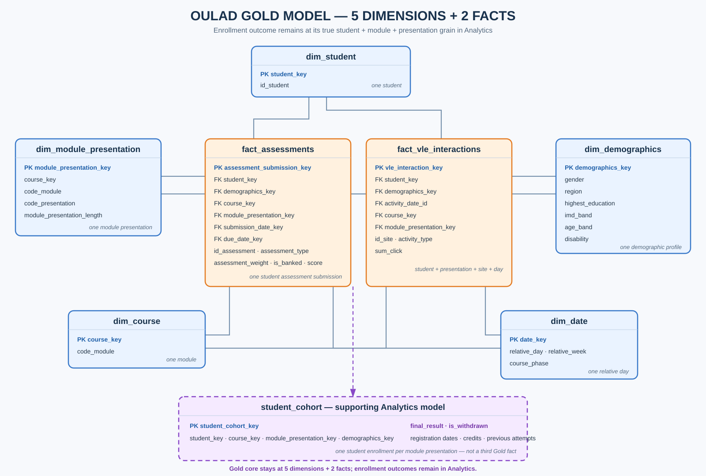

# OULAD Student Performance and Engagement Pipeline

This project turns seven Open University Learning Analytics Dataset (OULAD)
CSV files into clean, tested tables and dashboards. It helps us study student
performance, online activity, and withdrawal patterns.

## How it works

```text
CSV files -> Bronze (raw) -> Silver (clean) -> Gold (dbt mart)
          -> Analytics -> Metabase dashboards
```



- **Bronze** keeps the source data in its original form.
- **Silver** cleans values, fixes data types, and combines duplicates.
- **Gold/dbt mart** organizes the data into facts and dimensions.
- **Analytics** prepares useful totals, rates, and risk groups.
- **Metabase** presents the results in dashboards.
- **Data-quality checks** stop bad data from moving to the next stage.

## Final data model

The mart has five dimensions and two facts:

| Table | One row represents |
|---|---|
| `dim_student` | One student |
| `dim_course` | One course or module |
| `dim_module_presentation` | One specific course offering |
| `dim_date` | One relative course day |
| `dim_demographics` | One demographic profile |
| `fact_assessments` | One student assessment submission |
| `fact_vle_interactions` | One student's VLE activity on one relative day |

The two fact tables share the same dimensions, so this is also called a
**galaxy schema**.



## Requirements

- Access to the `ftw-week-07` Databricks catalog
- Databricks Runtime 14.2 LTS or newer
- A Databricks SQL warehouse
- Python 3 and dbt for Databricks
- The seven OULAD CSV files listed below

```text
assessments.csv
courses.csv
studentAssessment.csv
studentInfo.csv
studentRegistration.csv
studentVle.csv
vle.csv
```

## Step-by-step setup

### 1. Upload the CSV files

Upload all seven files to:

```text
/Volumes/ftw-week-07/00-source/cloudflare-r2/shared/week07
```

If your folder is different, update `source_path` in
`src/00_setup/01_setup.sql`.

### 2. Add the project to Databricks

Clone this repository into Databricks Repos or upload the whole project folder.
Do not change the folder structure because the notebooks use relative paths.

### 3. Build Bronze

Run `notebooks/01_bronze_oulad.sql`.

This checks the seven files, creates the schemas, loads the raw tables, and
runs Bronze data-quality tests.

### 4. Build Silver

Run `notebooks/02_silver_oulad.sql`.

This cleans the raw tables, standardizes data types, handles known missing
values, combines duplicate VLE rows, and runs Silver tests.

### 5. Configure dbt

From the repository root, install dbt:

```bash
python3 -m pip install -r requirements-dbt.txt
```

Copy `profiles.yml.example` to `~/.dbt/profiles.yml`. Then set these values with
your Databricks connection details:

```text
DATABRICKS_HOST
DATABRICKS_HTTP_PATH
DATABRICKS_TOKEN
```

Never upload your token to GitHub. Test the connection:

```bash
dbt debug
```

### 6. Build and test the mart

Run:

```bash
dbt build --select path:models/mart
```

dbt reads the Silver tables, creates the five dimensions and two facts in
`03-mart`, and tests keys, required values, allowed values, and relationships.
Continue only when every model and test passes.

### 7. Build Analytics and final DQ outputs

Run `notebooks/06_run_after_dbt.sql` after dbt succeeds.

This validates the mart, creates the Analytics tables, compares totals between
layers, and refreshes the data-quality views.

### 8. Build the dashboards

Connect Metabase to Databricks and synchronize `03-mart`, `04-analytics`, and
`05-data-quality`. Then use:

- `metabase/dashboard_queries.sql` for the business dashboard;
- `metabase/data_quality_dashboard_queries.sql` for the DQ dashboard; and
- `metabase/README.md` for chart and filter instructions.

## Correct run order

```text
1. notebooks/01_bronze_oulad.sql
2. notebooks/02_silver_oulad.sql
3. dbt build --select path:models/mart
4. notebooks/06_run_after_dbt.sql
5. Build or refresh the Metabase dashboards
```

## Expected schemas

| Schema | Contains |
|---|---|
| `01-raw` | Original CSV data |
| `02-clean` | Cleaned data |
| `03-mart` | dbt facts and dimensions |
| `04-analytics` | Business analysis tables |
| `05-data-quality` | Test results and DQ views |

## Final checks

Run this local repository check:

```bash
python3 scripts/check_repository.py
```

The pipeline is complete when the Bronze and Silver notebooks succeed, all dbt
models and tests pass, the post-dbt notebook succeeds, and both dashboards can
read the latest tables.

## Important notes

- The source has 173 missing assessment scores. They remain `NULL` instead of
  being guessed and are monitored by a warning check.
- OULAD dates are relative to the course start. A negative day means activity
  happened before the course officially started.
- `student_cohort` keeps every enrolled student, including students with no
  assessment or VLE activity, so enrollment and withdrawal rates are correct.
- Original team queries are still kept in `src/ingestion`, `src/cleaning`,
  `src/mart`, `src/data-quality`, and `tests/cleaning-validation.sql`. The
  numbered folders and notebooks are the final workflow.

For more detail, see `docs/pipeline.md`, `docs/data-model.md`, `src/README.md`,
and `tests/README.md`.

## Source

OULAD is published by OU Analyse and archived on Figshare under the CC BY 4.0
license.
