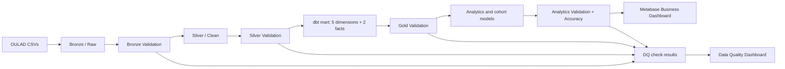

# Architecture

The dbt mart is the assignment implementation. The SQL under `src/03_gold/`
mirrors the same model for a Databricks-only demonstration runner.

Every transformed layer has a gate. The data-quality dashboard reads only the
Bronze, Silver, Gold, and Analytics validation outputs. The business dashboard
refreshes only after Analytics validation.

For the exact task sequence and dbt command, see `pipeline.md`.

OULAD is a fixed research snapshot, so deterministic full refresh is safer than
incremental state without a reliable source update timestamp. If recurring
files are introduced later, add batch metadata and process only affected keys.
