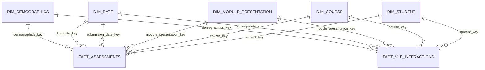

# Final OULAD star schema

## Scope

The core mart follows the professor's required model exactly: **two facts and
five dimensions**. It is a fact constellation because both facts share the same
conformed dimensions.

| Object | Key | Grain |
|---|---|---|
| `dim_student` | `student_key` | One anonymized student |
| `dim_course` | `course_key` | One module code |
| `dim_module_presentation` | `module_presentation_key` | One module and presentation |
| `dim_date` | `date_key` | One relative course day |
| `dim_demographics` | `demographics_key` | One distinct demographic profile |
| `fact_assessments` | `assessment_submission_key` | One student assessment submission |
| `fact_vle_interactions` | `vle_interaction_key` | One student, module presentation, VLE site, and relative day |

## Relationship diagram

Both facts connect directly to the five dimensions. The facts do not connect to
each other. Catalog relationships are registered by
`src/03_gold/sql/08_gold_relationships.sql` only after Gold validation passes.

## Course versus Module Presentation

These are separate because the assignment names both dimensions and they have
different grains:

- `dim_course`: the course/module itself, for example `AAA`.
- `dim_module_presentation`: a specific run, for example `AAA-2013J`.

`module_presentation_length` belongs to the presentation because the same
module can have different lengths in different presentations. The presentation
model keeps `course_key` for lineage and dbt tests that it maps to a valid
course. For simple BI navigation, both facts also carry `course_key`, so no
dimension-to-dimension join is required.

## Fact details

### `fact_assessments`

One row represents one student's submission for one assessment. It is the
event-based fact.

Foreign keys:

- `student_key` → `dim_student`
- `course_key` → `dim_course`
- `module_presentation_key` → `dim_module_presentation`
- `demographics_key` → `dim_demographics`
- `submission_date_key` and `due_date_key` → `dim_date`

Assessment ID, type, decimal weight, score, and banked status are stored in this
fact because Assessment is not one of the five required dimensions. A missing
score remains null. A due-date key may be null for exams whose source due
offset is null.

### `fact_vle_interactions`

One row represents a student's interactions with one VLE site on one relative
day. Silver groups repeated raw rows and sums their clicks, so this is the
required aggregated fact.

Foreign keys:

- `student_key` → `dim_student`
- `course_key` → `dim_course`
- `module_presentation_key` → `dim_module_presentation`
- `demographics_key` → `dim_demographics`
- `activity_date_id` → `dim_date`

VLE site ID, activity type, and `sum_click` are stored in the fact because VLE
Resource is not one of the five required dimensions. The full business grain
is module + presentation + student + VLE site + relative activity day.

## Date roles

OULAD dates are integer offsets relative to presentation start. They are not
calendar dates. Both assessment date keys and the VLE activity date key point
to the same physical `dim_date.date_key`.

The Databricks SQL compatibility build also creates three optional role-playing
views to make BI labels clearer without adding physical dimensions:

- `dim_submission_date`
- `dim_due_date`
- `dim_activity_date`

## Student and Demographics

`dim_student` contains stable identity. `dim_demographics` contains gender,
region, education, IMD band, age band, and disability. Its deterministic key
uses those demographic attributes only. `final_result` is excluded because it
describes a student's enrollment outcome rather than a demographic profile.

`demographics_key` is a surrogate key, but that alone does not make this SCD
Type 2. A true Type 2 dimension would need a student business key, effective
start/end boundaries, and a current-row indicator; OULAD does not provide a
reliable effective timeline for those changes.

## Supporting cohort model

`04-analytics.student_cohort` is intentionally outside the core Gold star. It
contains one student per module presentation and preserves students who have no
submission or VLE event. It supplies correct denominators for enrollment,
dropout, and risk analysis without adding a third core fact. `final_result` and
derived `is_withdrawn` live here at their correct enrollment grain.

## Expected source-aligned controls

| Control | Expected value for the supplied snapshot |
|---|---:|
| Courses | 7 |
| Module presentations | 22 |
| Distinct students | 28,785 |
| Assessment submissions | 173,912 |
| Missing assessment scores | 173 |
| VLE resources in source | 6,364 |
| Bronze VLE rows | 10,655,280 |

The final VLE fact is smaller than Bronze because of daily aggregation. Its
total `sum_click` must reconcile exactly.
